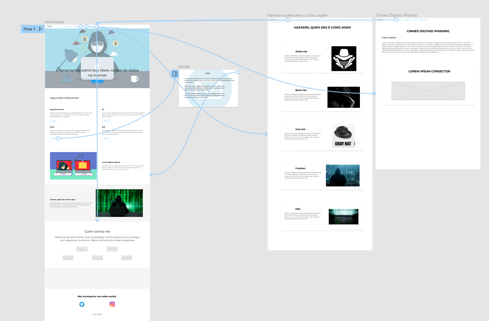
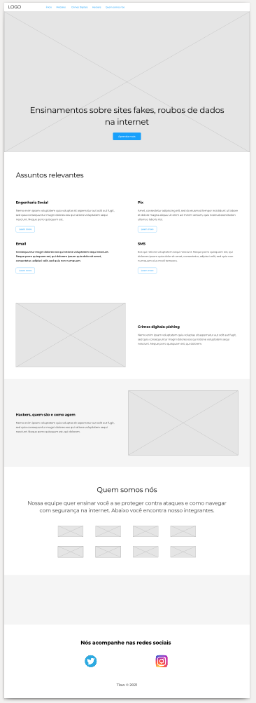

# Projeto de Interface

Com o intuito de conectar as páginas informativas do nosso portal. Elaboramos a seguinte estruturação de interface. Simples, objetiva e intuitiva. Com um navegador ao topo, e a home apresentação conexões direta as demais páginas. Todo o projeto de interface foi elaborado no Figma.

## User Flow

Para expressar nosso fluxo do usuário, criamos uma [apresentação interativa](https://www.figma.com/proto/9JNkgsWgwDvoqLFkB0tngC/Tiaw-Copy?node-id=101%3A91&scaling=min-zoom&page-id=0%3A1&starting-point-node-id=101%3A91) do mesmo, no próprio Figma.

## Wireframes

Idealizando nosso projeto, montamos um [arquivo em PDF](../Artefatos/Tiaw.pdf), contendo todo o wireframe do site.

