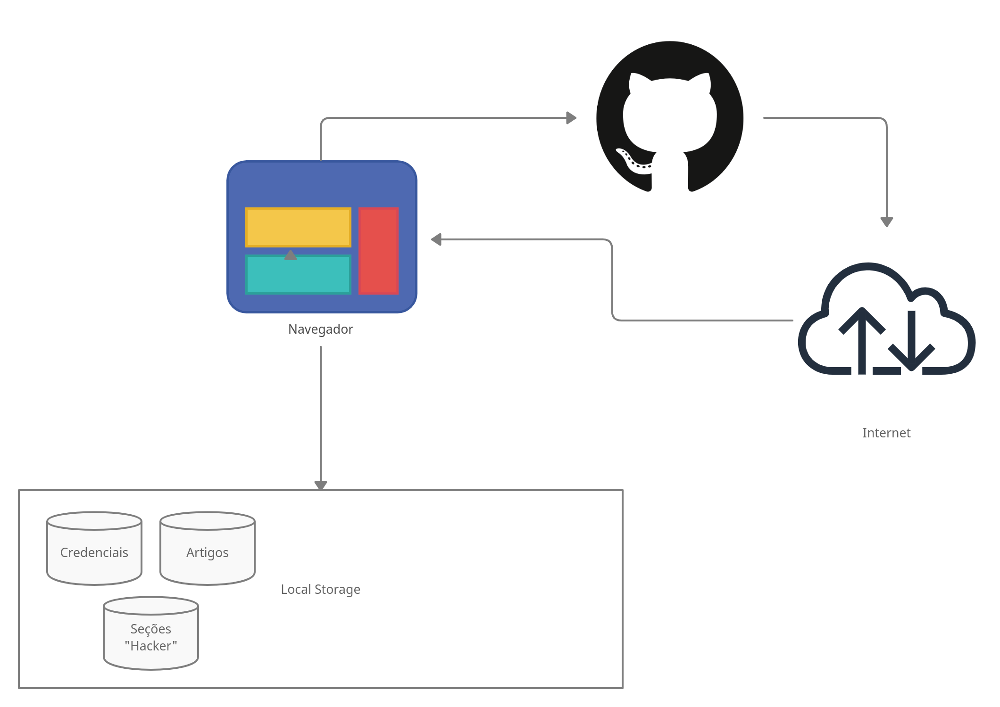

# Projeto da Solução

## Tecnologias Utilizadas

> - Front-End: HTML, CSS, JavaScript.
> - Framework: Bootstrap
> - IDEs: VSCode.
> - Versionamento: Git, GitHub.

## Arquitetura da solução

A imagem a seguir ilustra a arquitetura de nossa solução. 

Figura 1 - Arquitetura da solução

Por se tratar de um projeto simples e de livre acesso. O site está hospedado na web a partir da hospedagem gratuita do GitHub Pages, tendo como banco de dados o próprio localStorage do navegador.

Ao abrir o site caímos na home, onde é listado os tópicos de tecnologias mais usadas, com dados de proteção e maiores informações sobre a ferramenta.
O site conta com um menu que dá acesso aos módulos (tópicos das tecnologias), página de crimes digitais, com diversos artigos, pagina de Hackers com seção dedicada aos invasores e a opção de login para administradores.

Também é listado na home uma opção de busca, que varre todo o site buscando pelo texto inserido.

Atraves do painel da opção de login, um adiministrador tem a possibilidade de entrar como super usuário e ter acesso ao "painel do admin",
onde é possível editar os artigos, criar novos, editar toda a página de hackers, entre outros.

O fluxo do usuário disponível no link: [User Flow](./3-Interface.md), ilustra a interação do usuário em nossa solução.
